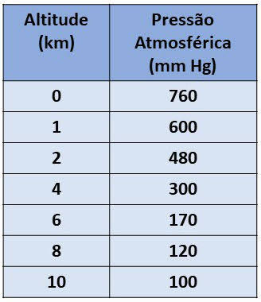

# Projeto Icarus

Lançamento de balão meteorológico para filmagem da curvatura da Terra

### Balão escolhido

800g transportando carga de 1.5kg com eficiência, com máximo de 6 m³ de gás hélio

[Balão Meteorológico de Grande Altitude - 800g](http://www.mundoclima.com.br/produtos/balao-meteorologico-de-grande-altitude-800g/)

```
p1*v1 = p2*v2
```

### Pressão atmosférica pela altitude



| Altitude (km) | Pressão Atmosférica (mm Hg) |
| --- | --- |
| 0 | 760 |
| 1 | 600 |
| 2 | 480 |
| 4 | 300 |
| 6 | 170 |
| 8 | 120 |
| 10 | 100 |


### Links úteis


Pressão atmosférica em milibar

[Pressão atmosférica em mbar](https://www.climadobrasil.com.br/pressao)


Conversão milibar para kPa 1 mbar = 0.1 kPa
[Google mbar -> kPa](https://www.google.com/search?sxsrf=ACYBGNSiJ2YNljN4g9IwVUoHwd-VjxnYBQ%3A1580477305751&ei=eSs0Xsu0LdSx5OUPqqaeuAQ&q=mbar+to+kpa&oq=mbar+to+kpa&gs_l=psy-ab.3..0i273j0l4j0i22i30l2j0i22i10i30j0i22i30l2.63563.65321..66433...0.2..0.221.1060.0j4j2......0....1..gws-wiz.......0i71j35i39j0i20i263j0i10j0i203.Z0tkKs-SHU4&ved=0ahUKEwiL1Ynj-K3nAhXUGLkGHSqTB0cQ4dUDCAs&uact=5)

Conversão milibar para mmHg 1 mbar = 0.750062 mmHg
[Google mbar -> mmHg](https://www.google.com/search?sxsrf=ACYBGNRMZewlMVj4lYED1Zqtw0lF6JWkoQ%3A1580477373138&ei=vSs0XtaDCJGH0AbGwbrYCQ&q=mbar+to+mmhg&oq=mbar+to+mm&gs_l=psy-ab.3.0.0i203l3j0j0i20i263l2j0l4.103983.104119..105311...0.3..0.160.309.0j2......0....1..gws-wiz.......0i71.nmuxnWJ7Vc0)

[Balloon Trajectory Forecasts](http://weather.uwyo.edu/upperair/balloon_traj.html)

[Lei de Boyle sobre a transformação isotérmica](https://mundoeducacao.bol.uol.com.br/quimica/lei-boyle-sobre-transformacao-isotermica.htm)


[Lançamento de balão meteorológico à estratosfera](https://garoa.net.br/wiki/Lan%C3%A7amento_de_bal%C3%A3o_meteorol%C3%B3gico_%C3%A0_estratosfera)

[Balão Meteorológico de Grande Altitude - 600g](http://www.mundoclima.com.br/produtos/balao-meteorologico-de-grande-altitude-600g)